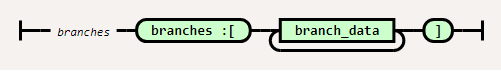
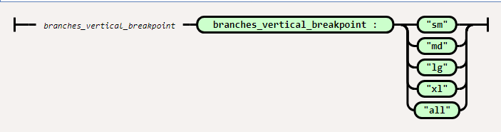

# bootstrap-vue-reponsive-organization-chart
A responsive organisation chart built by bootstrap-vue
## Why I start this repository
### inspired by another repository 2 CSS files.
I have my own project to create organisation chart on static webpages, and found the repository  https://github.com/zkoss-demo/zk-template-examples has 2 CSS files useful.  
The files are :  
- [src/main/webapp/orgchart/css/orgchart-vertical.css](https://github.com/zkoss-demo/zk-template-examples/blob/master/src/main/webapp/orgchart/css/orgchart-vertical.css)
- [src/main/webapp/orgchart/css/orgchart.css](https://github.com/zkoss-demo/zk-template-examples/blob/master/src/main/webapp/orgchart/css/orgchart.css)

They demo their product a Java framework called ZK framework, you can visit [the tutorial](https://dzone.com/articles/css-flex-based-orgchart-with-zk)  
My project is a frontend only static website, so I borrow their CSS and start to render the html by frontend framework, such as VueJS.


## At a glance what it can do


## Browser compatibility
Modern browser support ES6, FlexBox css.  
You can transpile the js into ES5 to running in IE11, actually I have done this before and work, but I will not support IE11 anymore.
Please let me know if your browser don't work.

## Prerequisites
I made it mainly by VueJS and bootstrap-vue. You should have some beginner knowleage on them. Actually I am a newbie on them, so relax.
- [bootstrap-vue v2.0.0](https://bootstrap-vue.js.org/)
- [Vue.js v2.6](https://vuejs.org/)
- [Bootstrap v4.3](https://getbootstrap.com/)

## Setup
1. Download [OrgChart.css](src/OrgChart.css) and [OrgChart.js](src/OrgChart.js).
2. On your html page, load framework before load them.
```html
    <!-- Load required Bootstrap and BootstrapVue CSS -->
    <link type="text/css" rel="stylesheet" href="//unpkg.com/bootstrap/dist/css/bootstrap.min.css" />
    <link type="text/css" rel="stylesheet" href="//unpkg.com/bootstrap-vue@latest/dist/bootstrap-vue.min.css" />

    <!-- Load Vue followed by BootstrapVue -->
    <script defer src="//unpkg.com/vue@latest/dist/vue.min.js"></script>
    <script defer src="//unpkg.com/bootstrap-vue@latest/dist/bootstrap-vue.min.js"></script>

    <!-- OrgChart css and js -->
    <link rel="stylesheet" href="OrgChart.css">
    <script defer src="OrgChart.js"></script>    
```

## How to use
### Concept
It is simple, organisation chart is composed of node and branch.  

### Action
All we have to do is jsonify the node and branch, and input them to OrgChart Vue Component.  
### Json guide
* The railroad diagrams are generated by using project [Railroad-diagram Generator from tabatkins](https://github.com/tabatkins/railroad-diagrams)





## to do....
+ beautify the example
+ make more example
+ to demo vertical branch
+ empty node
+ json schema for the orgchart data json


