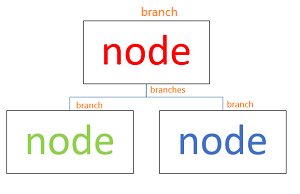
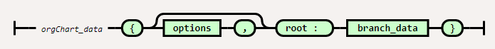
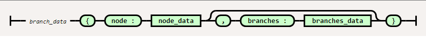

# bootstrap-vue-reponsive-organization-chart
A responsive organisation chart built by bootstrap-vue
## Why I start this repository
### inspired by another repository 2 CSS files.
I have my own project to create organisation chart on static webpages, and found the repository  https://github.com/zkoss-demo/zk-template-examples has 2 CSS files useful.  
The files are :  
- [src/main/webapp/orgchart/css/orgchart-vertical.css](https://github.com/zkoss-demo/zk-template-examples/blob/master/src/main/webapp/orgchart/css/orgchart-vertical.css)
- [src/main/webapp/orgchart/css/orgchart.css](https://github.com/zkoss-demo/zk-template-examples/blob/master/src/main/webapp/orgchart/css/orgchart.css)

They demo their product a Java framework called ZK framework, you can visit [the tutorial](https://dzone.com/articles/css-flex-based-orgchart-with-zk)  
My project is a frontend only static website, so I borrow their CSS and start to render the html by frontend framework, such as VueJS.


## At a glance what it can do
You can see this example code at [example_1](examples/example_1)


## Browser compatibility
Modern browser support ES6, FlexBox css.  
You can transpile the js into ES5 to running in IE11, actually I have done this before in earlier version and work, but I will not support IE11 anymore.  
Please let me know if your browser don't work.

## Prerequisites
I made it mainly by VueJS and bootstrap-vue. You should have some beginner knowleage on them. Actually I am a newbie on them, so relax.
- [bootstrap-vue v2.0.0](https://bootstrap-vue.js.org/)
- [Vue.js v2.6](https://vuejs.org/)
- [Bootstrap v4.3](https://getbootstrap.com/)

## Setup
1. Download [OrgChart.css](src/OrgChart.css) and [OrgChart.js](src/OrgChart.js).
2. On your html page, load framework before load them.
```html
    <!-- Load required Bootstrap and BootstrapVue CSS -->
    <link type="text/css" rel="stylesheet" href="//unpkg.com/bootstrap/dist/css/bootstrap.min.css" />
    <link type="text/css" rel="stylesheet" href="//unpkg.com/bootstrap-vue@latest/dist/bootstrap-vue.min.css" />

    <!-- Load Vue followed by BootstrapVue -->
    <script src="//unpkg.com/vue@latest/dist/vue.min.js"></script>
    <script src="//unpkg.com/bootstrap-vue@latest/dist/bootstrap-vue.min.js"></script>

    <!-- Load font awesome css -->
    <link rel="stylesheet" href="//cdnjs.cloudflare.com/ajax/libs/font-awesome/5.11.2/css/all.min.css"> 

    <!-- OrgChart css and js -->
    <link rel="stylesheet" href="OrgChart.css">
    <script src="OrgChart.js"></script>    
```

## How to use
### Concept
It is simple, organisation chart is composed of node and branch.  

### Action
All we have to do is create a javascript object to store all nodes and branches, and input them to OrgChart Vue Component. Something like this below  
```javascript
      const myOrgData = {
        root: {
          node: redNode,
          branches: {
            items: [
                { node: greenNode },
                { node: blueNode }
            ]
          }
        }
      };
```
### So, what is the schema of the object...
* The railroad diagrams are generated by using project [Railroad-diagram Generator from tabatkins](https://github.com/tabatkins/railroad-diagrams)

  
  
**mobile_breakpoint**  
type : String  
value : "sm" | "md" | "lg" | "xl"  
default : "sm"  
Usage : The org chart will be shown in 1 of 2 forms, collapsed boxes or tree form, depend on the screen width. Here the breakpoint setting to determine the width value to switch form.  

value|screen width (px)
---|---
"sm" | 576
"md" | 768
"lg" | 992
"xl" | 1200

  
**connector_color**  
type : String  
value : any css color value in string  
default : "#cccccc"  
  
  
**node_data**  
html : content of each node in html   
classes : assign class, so you can apply css style   
link : URL value, if it exist, the node will be a link    
  
  
**vertical_breakpoint**  
type : String  
value : "sm" | "md" | "lg" | "xl" | "*"  
Usage : When the org chart in tree form, the branches are rendered horizontally by default, it can be vertically depend on the screen width if vertical_breakpoint is provided. Here the breakpoint setting to determine the width value to switch.  

value|screen width (px)
---|---
"sm" | 576
"md" | 768
"lg" | 992
"xl" | 1200
"*"  | force to vertical

```javascript
// this is a sample to demo vertical_breakpoint
const myOrgData = {
    root: {
        node: redNode,
        branches: {
        vertical_breakpoint: "md",  // switch when screen widht 768px
        items: [{ node: greenNode }, { node: blueNode }]
        }
    }
};
```
  
### sample code
Below is the complete sample code, which will output  
   
```html
  <body>
    <style>
      .myNode {
        border: solid 1px black;
      }
      .redNode {
        color: red;
      }
      .greenNode {
        color: green;
      }
      .blueNode {
        color: blue;
      }
    </style>

    <div id="app">
      <org-chart :org-chart_data="myOrgData"></org-chart>
    </div>

    <script>
      const myNode = { html: "<div>node</div>" };
      myNode.classes = "myNode";
      const redNode = { ...myNode };
      redNode.classes += " redNode";
      const greenNode = { ...myNode };
      greenNode.classes += " greenNode";
      const blueNode = { ...myNode };
      blueNode.classes += " blueNode";
      const myOrgData = {
        root: {
          node: redNode,
          branches: {
            vertical_breakpoint: "md",
            items: [{ node: greenNode }, { node: blueNode }]
          }
        }
      };
      new Vue({
        el: "#app",
        data: { myOrgData }
      });
    </script>
  </body>
```

### More examples at
- [example_1](examples/example_1)
- [example_2](examples/example_2)
- [example_3](examples/example_3)
